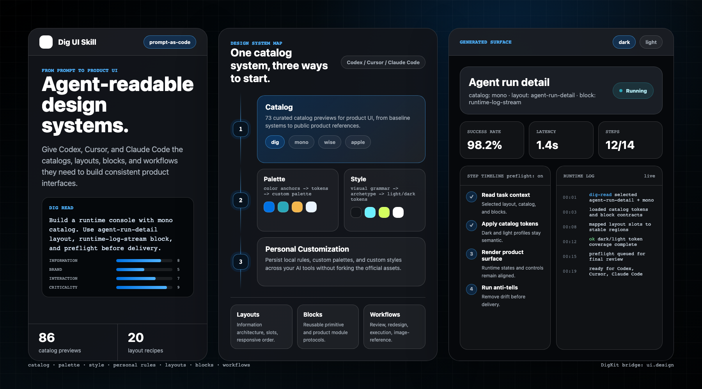
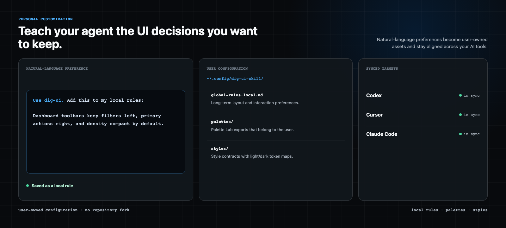
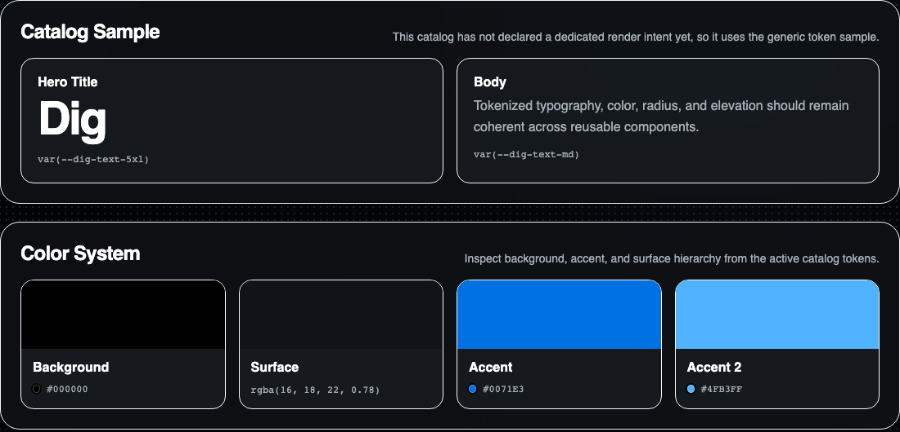
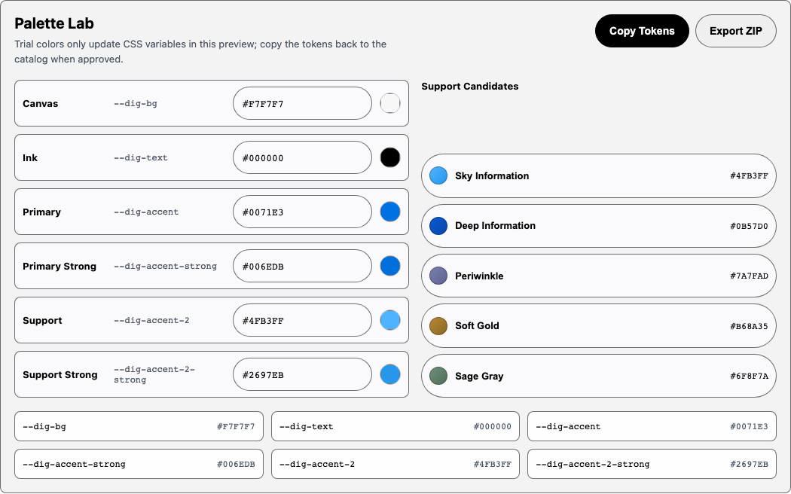
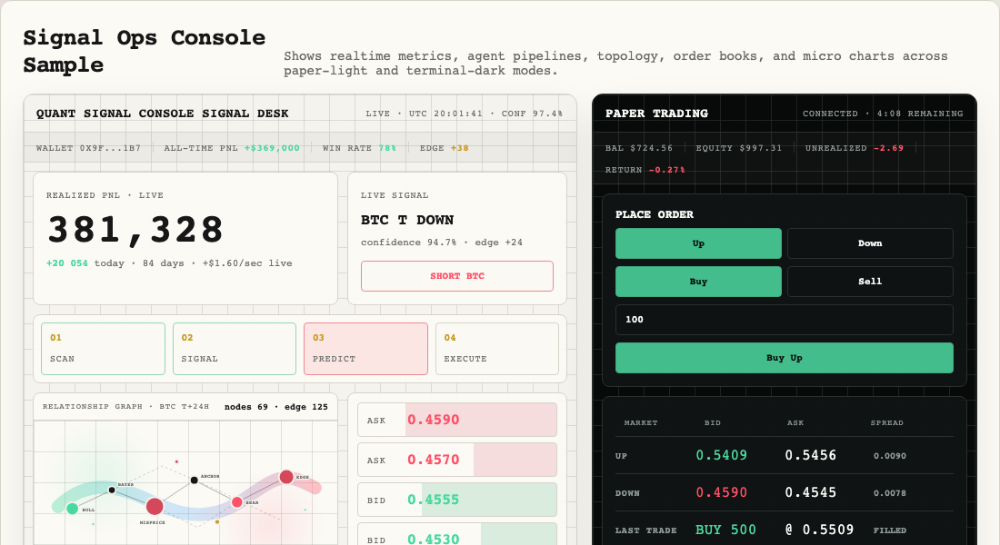

<p align="center">
  
</p>

<h1 align="center">Dig UI Skill</h1>

<p align="center">
  Agent-readable design systems for product UI.
</p>

<p align="center">
  One command to give Codex, Cursor, and Claude Code a durable UI design language.
</p>

<p align="center">
  <a href="./README.zh-CN.md">中文</a> ·
  <a href="./INSTALL.md">Installation</a> ·
  <a href="./USAGE.md">Usage Guide</a> ·
  <a href="./renders/index.html">Catalog Previews</a> ·
  <a href="#user-content-personal-customization">Personal Customization</a> ·
  <a href="#latest-highlights">Latest Highlights</a> ·
  <a href="#what-you-can-build">What You Can Build</a>
</p>

<p align="center">
  <a href="./LICENSE"></a>
  <a href="https://www.npmjs.com/package/dig-ui-skill"></a>
  
  
  
</p>

<p align="center">
  
</p>

Dig UI Skill is a prompt-as-code design system for AI coding agents. It does not ship a conventional component library. Instead, it gives agents the catalogs, layout recipes, block contracts, workflows, local extension rules, and preview renders they need to generate consistent product interfaces.

```text
Catalog gives taste.
Palette and Style give extensibility.
Personal rules give ownership.
Layouts and blocks give structure.
Workflows make it repeatable.
```

## Quick Start

Install Dig UI Skill into one AI tool:

```bash
npx dig-ui-skill install codex
npx dig-ui-skill install cursor
npx dig-ui-skill install claude-code
```

Install everywhere and check status:

```bash
npx dig-ui-skill install --all
npx dig-ui-skill status
```

Use it from your agent:

```text
Use Dig UI. Start with references/dig-read.md, use the dashboard-overview layout, apply the dig catalog, and run preflight before delivery.
```

Choose the installed language:

```bash
npx dig-ui-skill install codex --lang en
npx dig-ui-skill install codex --lang zh-CN
```

To use Dig UI in WorkBuddy, see [WorkBuddy](#workbuddy).

For installation and update details, see the [installation guide](./INSTALL.md#installation).

<a name="personal-customization"></a>

## 

Teach your agent the UI decisions you want to keep. Dig UI Skill turns natural-language preferences into user-owned rules, palettes, and styles that stay aligned across Codex, Cursor, and Claude Code.

<p align="center">
  
</p>

| Keep | Own | Sync |
| --- | --- | --- |
| Layout, density, hierarchy, and interaction preferences that should persist. | `global-rules.local.md`, custom palettes, and custom styles outside the repository. | The same personal assets into every installed AI tool. |

Both Local Rules flows end at the same user-owned source of truth:

```text
~/.config/dig-ui-skill/global-rules.local.md
```

### 1. You already have a `global-rules.local.md`

Import the Markdown file, then explicitly synchronize it to the installed tools:

```bash
npx dig-ui-skill local import --from ./global-rules.local.md
npx dig-ui-skill local sync --all --from-config
```

### 2. You have preferences in natural language

Tell any compatible Host Agent what you want to retain:

```text
Use dig-ui. Add this to my local rules:
Use #0071e3 as the default blue accent, with white text on primary buttons.
```

See the [usage guide](./USAGE.md#local-rules) for Local Rules.

## Latest Highlights

| Date | Highlight | Why it matters |
| --- | --- | --- |
| **2026-08-04** | **Local Rules import/export and Host Agent workflows** landed. | Bring an existing Markdown file or ask a Host Agent in natural language; both maintain one user-owned source of truth and sync only to installed tools. |
| **2026-07-23** | **Style routing and dual-theme previews** landed. | Built-in style catalogs now route by task and avoid boundary, while Style Lab exports complete light/dark token maps as a user-owned contract. |
| **2026-07-10** | **Color Palette Catalog and Palette Lab** landed. | Users can start from color-first catalogs, tune anchors in Palette Lab, export ZIP assets, and sync custom palettes across tools. |
| **2026-06-29** | **Layout and block renders were retired** as canonical UI previews. | Catalogs remain visual renders; layouts and blocks stay Markdown contracts so structure and behavior do not become a second visual source of truth. |
| **2026-06-28** | **Dig Read, dials, anti-tells, preflight, and workflows** were consolidated. | Agents now choose layout, catalog, blocks, density, brand energy, interaction energy, and delivery checks before writing UI. |

## What You Can Build

| You want to... | Use Dig UI Skill to... | Start with |
| --- | --- | --- |
| Review an existing UI | Check layout consistency, catalog fit, missing states, responsive behavior, and common AI UI drift. | `references/workflows/review.md` |
| Generate a product dashboard | Pick a layout recipe, apply a catalog, use block contracts, and run preflight. | `references/layouts/dashboard-overview.md` |
| Build runtime or agent execution screens | Use execution workflows, log blocks, step timelines, and high-density operational surfaces. | `references/layouts/agent-run-detail.md` |
| Customize a color system | Start from palette catalogs, export from Palette Lab, and sync a custom palette. | `references/catalogs/palettes/` |
| Capture a complete visual grammar | Export a style contract and sync it as a local custom style. | `references/catalogs/styles/` |
| Teach your agent personal UI taste | Persist local global rules, palettes, and styles outside the repository. | `references/local-rules-builder.md` |

## Core System

| Layer | Role | Source |
| --- | --- | --- |
| **Dig Read** | First-pass task framing, asset selection, and product dials. | `references/dig-read.md` |
| **Catalog** | 73 curated product UI languages: tokens, typography, surface rules, components, density, and tone. | `references/catalogs/` |
| **Palette** | Color-first customization, Palette Lab, and importable palette contracts. | `references/catalogs/palettes/` |
| **Style** | Full visual grammars, render archetypes, dual-theme tokens, and custom style exports. | `references/catalogs/styles/` |
| **Layouts** | Information architecture, slots, responsive order, and QA notes. | `references/layouts/` |
| **Blocks** | Reusable primitive and product-module behavior contracts. | `references/blocks/` |
| **Workflows** | Repeatable review, redesign, execution, and image-reference processes. | `references/workflows/` |
| **Preflight** | Delivery gate for states, structure, catalog choice, and anti-patterns. | `references/preflight.md` |

## Catalogs

Choose one base catalog for a page or component group. Catalog gives you a mature product UI language, Palette starts from color relationships, and Style carries a complete visual grammar.

For choosing a catalog, palette, or style, see the [usage guide](./USAGE.md#visual-system).

### Catalog

<p align="center">
  
</p>

Start here when a known product language, a mature product surface, or a reliable baseline is your reference. Catalogs are agent-readable design contracts, not screenshots to copy and not component packages to import.

**Includes:** 73 product UI catalogs across AI, SaaS, fintech, dev tools, DevOps, creative tools, commerce, media, automotive, and Dig foundations. Start with `dig`, `mono`, `wise`, or `apple`, then browse the full set in [`renders/index.html`](./renders/index.html).

**Customize:** keep the built-in catalog as the visual base and add project-specific rules through local global rules, layouts, and blocks. Personal preferences belong in local assets rather than a fork of an official catalog.

### Palette

<p align="center">
  
</p>

Start here when color relationships are the primary decision: an anchor color, an existing palette, a mood, or a site-level color system.

**Includes:** built-in palette catalogs and Palette Lab, which maps canvas, ink, primary, support, and semantic roles into usable Dig tokens.

**Customize:** tune anchors in Palette Lab, export a `custompalette`, then import and sync it across tools:

```bash
npx dig-ui-skill palette import ~/Downloads/palette01.custompalette.zip codex
npx dig-ui-skill palette list
npx dig-ui-skill palette sync --all
```

User-owned palettes live in `~/.config/dig-ui-skill/palettes/` and sync into `references/local/palettes/` without changing the built-in catalog set.

Palette details: [usage guide](./USAGE.md#palette).

### Style

<p align="center">
  
</p>

Start here when you need more than a color theme. A style carries material choices, surface behavior, component tone, render archetype, and a complete light/dark token contract together.

**Includes:** 12 built-in visual grammars, including `cozy-arcade`, `quant-signal-console`, `business-editorial`, and `research-lab`. The [style routing guide](./references/catalogs/styles/README.md) helps select one by task and avoid boundary.

**Customize:** export a `customstyle` from Style Lab, then import and sync it across tools:

```bash
npx dig-ui-skill style import ~/Downloads/quant-signal-console.customstyle.zip codex
npx dig-ui-skill style list
npx dig-ui-skill style sync --all
```

User-owned styles live in `~/.config/dig-ui-skill/styles/` and sync into `references/local/styles/`. They remain user assets, not built-in catalog entries.

Style details: [usage guide](./USAGE.md#style).

## Layouts And Blocks

Catalogs define look. Layouts define structure. Blocks define repeatable UI behavior.

Dig UI Skill includes **20 layout recipes** for dashboards, docs, runtime consoles, table workspaces, settings forms, onboarding, pricing, search, auth, and marketing pages.

Blocks cover primitive and product-module protocols:

```text
button, input, select, tooltip, modal, tabs
table-toolbar, runtime-log-stream, run-status-header
step-timeline, settings-row, notification-item, search-result-row
```

Core paths:

```text
references/layouts/
references/blocks/
references/shared/layout-manifest.yaml
references/shared/block-manifest.yaml
```

Layout and Block details: [usage guide](./USAGE.md#layouts-blocks).

## Workflows

Workflows turn Dig UI Skill from a static asset library into a repeatable agent process.

```text
references/workflows/review.md
references/workflows/redesign.md
references/workflows/execution.md
references/workflows/image-reference.md
references/anti-tells.md
references/preflight.md
```

Use them to review an existing UI, redesign a surface while preserving business meaning, build execution and runtime screens, translate from visual references, and filter common AI UI drift before delivery.

Review and redesign details: [usage guide](./USAGE.md#review-redesign).

## Use In Your AI Tool

### Codex

```bash
npx dig-ui-skill install codex
```

```text
Use the dig-ui skill. Review this page against the Dig catalog and the dashboard-overview layout.
```

### Cursor

```bash
npx dig-ui-skill install cursor
npx dig-ui-skill install cursor --project /path/to/your/repo
```

```text
Use Dig UI. Apply references/layouts/settings-form.md and references/catalogs/other/dig.md to this screen.
```

### Claude Code

```bash
npx dig-ui-skill install claude-code
npx dig-ui-skill install claude
```

```text
Use Dig UI to refactor this UI. Start from the runtime-console layout and apply the mono catalog.
```

### WorkBuddy

Export a self-contained upload package:

```bash
npx dig-ui-skill export workbuddy
```

The default `~/.config/dig-ui-skill/dig-ui-workbuddy.zip` includes the selected language and current personal assets. In WorkBuddy, choose **Skills → Add Skill → Upload** and select the ZIP; re-running the command replaces it.

For a custom output path or an English bundle, see [the WorkBuddy installation guide](./INSTALL.md#workbuddy).

## Examples

Review a UI:

```text
Use Dig UI. Review this settings page with references/workflows/review.md, references/layouts/settings-form.md, and references/catalogs/other/dig.md.
```

Generate a runtime surface:

```text
Use Dig UI. Build an agent run detail page with agent-run-detail layout, mono catalog, run-status-header, step-timeline, and runtime-log-stream blocks.
```

Customize taste:

```text
Use Dig UI. Add a local rule that #0071e3 is the default blue accent and primary buttons use white text.
```

## Repository Structure

```text
dig-ui-skill/
├── SKILL.md                         # Skill entry used by Codex-compatible tools
├── references/
│   ├── global-rules.md              # Cross-catalog behavior rules
│   ├── dig-read.md                  # Agent task framing and product dials
│   ├── catalogs/                    # Catalog, palette, and style assets
│   ├── layouts/                     # Layout recipes
│   ├── blocks/                      # Primitive and product block contracts
│   ├── workflows/                   # Repeatable agent workflows
│   ├── local/                       # Project-level extensions
│   ├── anti-tells.md                # Common AI UI drift filters
│   └── preflight.md                 # Delivery gate
├── renders/                         # Static catalog preview output
├── assets/                          # README assets and catalog preview CSS
├── adapters/                        # Tool-specific adapters
├── agents/                          # Agent metadata
└── bin/dig-ui-skill.mjs             # Installer and sync CLI
```

## Development

Install dependencies:

```bash
npm install
```

Sync catalog previews:

```bash
./sync-renders.sh
```

Validate catalog previews:

```bash
npm run validate:catalogs
npm run validate:renders
```

Use the local repository as the install source while developing:

```bash
node bin/dig-ui-skill.mjs install cursor --source .
node bin/dig-ui-skill.mjs install --all --source .
```

## Contributing

This repository is being prepared for public open source release. Until a dedicated `CONTRIBUTING.md` lands, prefer small, reviewable changes and keep the source-of-truth boundaries clear:

- Catalogs describe visual language and tokens.
- Layouts describe information architecture and slots.
- Blocks describe reusable UI behavior contracts.
- Workflows describe repeatable agent processes.
- User palettes, styles, and personal rules stay outside the official asset set.

## Open Source Notes

Catalog files describe design-language observations and abstract rules inspired by public product surfaces. Product names, logos, and trademarks belong to their respective owners. This project is not affiliated with, endorsed by, or sponsored by those companies.

If you contribute a new catalog, prefer design-system analysis over copied proprietary assets. Do not add private brand files, licensed fonts, screenshots, confidential design tokens, or unauthorized brand assets.

## License

Licensed under the [Apache License 2.0](./LICENSE).
